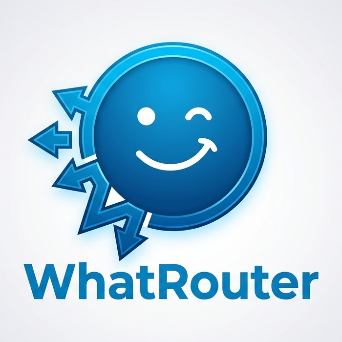

<p align="center">
  
</p>

# WhatRouter

WhatRouter is a [Hermes Agent](https://github.com/NousResearch/hermes-agent) **Relay connector for
WhatsApp**. It owns one WhatsApp account — a dedicated bot number, linked once with a QR code or a
pairing code — and multiplexes it to any number of Hermes instances, using a static YAML file to
decide which chat belongs to which instance. Each instance is a *profile* with its own
`gateway_id` and secret; routes bind DMs (by phone number) and groups (by JID) to exactly one
profile. Messages for an instance that is offline are buffered durably and replayed, in order and
exactly once, when it comes back.

**Why not `hermes whatsapp`?** Hermes ships a native Baileys bridge, but it is one account to one
instance: the agent process holds the WhatsApp credentials, and a second instance needs a second
phone number. WhatRouter inverts that. It is the sole holder of the WhatsApp session, each Hermes
instance authenticates to it with its own secret over an outbound WebSocket, and a per-chat route
table decides who sees what — so your work agent and your home agent can share one number without
sharing credentials or seeing each other's chats, and neither of them loses a message while it is
being restarted or upgraded.

**Not affiliated with Nous Research or WhatsApp.** This is a community project that implements the
published Hermes relay connector contract. WhatsApp access goes through
[Baileys](https://github.com/WhiskeySockets/Baileys), an unofficial reverse-engineered client:
WhatsApp does not support it and may restrict or ban accounts that use it. Use a dedicated number
you can afford to lose, never send unsolicited outbound messages, and keep the traffic
conversational.

## Architecture

```
            WhatsApp (Baileys multi-device session; credentials live ONLY here)
                              |  one socket, one account
                              v
 +------------------------- WhatRouter -----------------------------+
 | whatsapp/   Baileys client: connect/reconnect, pair, normalize    |
 |             inbound -> InboundMessage, execute outbound ops       |
 | router/     config routes -> profile; relevance gate (mention/    |
 |             reply); tenant check on outbound                      |
 | relay/      WS server /relay (HMAC bearer), NDJSON frames,        |
 |             per-profile session actor, sqlite buffer + replay,    |
 |             wake poke, /relay/policy, /relay/media, /healthz      |
 | store/      node:sqlite: buffer, idle flips, policies, media      |
 +-------------------------------------------------------------------+
                              ^  outbound-only dials (wss://.../relay)
          hermes gateway "work"        hermes gateway "home"   ...
          GATEWAY_RELAY_URL / _ID / _SECRET / _PLATFORMS=whatsapp
```

Trust model:

- WhatRouter is the only process holding WhatsApp credentials. They never leave
  `<data_dir>/wa-auth`.
- Each Hermes instance authenticates per profile with a long-lived shared secret; a compromised
  instance can impersonate only itself.
- A profile may only act on chats routed to it. Outbound to anything else is refused
  (`chat not routed to this profile`) unless `allow_unrouted_outbound: true`.
- Nothing dials in to Hermes: gateways always dial out, so instances can sit behind NAT with no
  inbound ports and no certificates of their own.

**The protocol in one paragraph.** Each Hermes instance opens one outbound WebSocket to
`GET /relay` with an `Authorization: Bearer` token derived by HMAC-SHA256 from its profile secret
(`base64url("{gatewayId}:{exp}:{sig}")`, minted per connection with a 300 s TTL). The socket then
carries newline-delimited JSON frames: the gateway sends `hello`, WhatRouter answers with a
capability descriptor (platform, message limits, markdown dialect, the exact list of supported
ops); inbound WhatsApp messages travel as `inbound` frames and outbound agent actions as
`outbound` frames answered by `outbound_result`. Delivery is ack-gated: anything that cannot go
out live is appended to a per-profile sqlite buffer and replayed one at a time with a `bufferId`
the gateway must acknowledge, so a restart loses nothing and duplicates nothing. If an instance is
offline and a `wake_url` is configured, WhatRouter pokes it once per cooldown window.

Details: [docs/DESIGN.md](docs/DESIGN.md) — and the upstream contract this implements:
<https://hermes-agent.nousresearch.com/docs/developer-guide/relay-connector-contract>.

## Quick start (Docker)

Compose builds the image from this checkout, so start by cloning the repo onto the host that will
run WhatRouter (it needs a stable, reachable address if your Hermes instances live elsewhere).

**1. Write the config.**

```bash
git clone <repo-url> whatrouter && cd whatrouter
cp config.example.yaml config.yaml
openssl rand -hex 32          # one per profile, paste into config.yaml
```

Edit `config.yaml`:

- **Keep `data_dir: /data`** (the volume). A relative path such as `./data` resolves under
  `/app` inside the container, which is not writable, and pairing fails with
  `EACCES: permission denied, mkdir 'data'`.
- Set `public_url` to the address your Hermes instances will dial
  (`https://whatrouter.example.com`, or `http://<host-ip>:8466` on a LAN).
- Give every Hermes instance a profile with a unique `gateway_id` and secret, and list the DMs and
  groups it should receive.

**2. Validate it.**

```bash
docker compose run --rm whatrouter check-config
```

Prints a summary and `config OK`, or one line per problem and exit code 2.

**3. Link the WhatsApp account (once).**

```bash
docker compose run --rm -it whatrouter pair
```

Scan the QR with WhatsApp on the bot phone: Settings -> Linked devices -> Link a device. If the
terminal cannot render a QR code, use the pairing-code flow instead and type the printed eight
characters into "Link with phone number instead":

```bash
docker compose run --rm -it whatrouter pair --code +34600000000
```

It prints `Paired as <number>. Credentials saved to /data/wa-auth.` and exits 0. `serve` never
prints a QR code; pairing is always this explicit one-off.

**4. Start it.**

```bash
docker compose up -d
curl -s localhost:8466/healthz
docker compose logs -f
```

**5. Point each Hermes instance at it.** For the profile named `work`:

```bash
docker compose run --rm whatrouter env work >> ~/.hermes/.env
hermes gateway restart
```

That appends exactly four lines:

| Line | Meaning |
|---|---|
| `GATEWAY_RELAY_URL=wss://whatrouter.example.com/relay` | Where the gateway dials. Derived from `public_url`; falls back to `ws://localhost:8466/relay`. |
| `GATEWAY_RELAY_ID=gw-work` | The profile's `gateway_id`. Identifies which profile is connecting. |
| `GATEWAY_RELAY_SECRET=<32+ chars>` | The shared secret that signs the bearer token. Setting it also stops Hermes from trying to self-provision. |
| `GATEWAY_RELAY_PLATFORMS=whatsapp` | The platforms this gateway fronts through the relay. |

If Hermes runs on another host, run the `env` command on the WhatRouter host and copy the four
lines across — that is the only place the secret exists.

**6. Test it.** Send a WhatsApp DM to the bot number from one of the phone numbers you routed to
`work`. The message shows up in that instance's logs and the agent replies in the chat. In a
routed group, mention the bot (or reply to it) unless you set `require_mention: false`.

## Quick start (Node, no Docker)

Node 24 or newer, because WhatRouter uses the built-in `node:sqlite`. `ffmpeg` on `PATH` is
optional: without it, voice replies are sent as ordinary audio attachments instead of voice notes.

```bash
npm ci
npm run build

cp config.example.yaml config.yaml   # edit it; set data_dir to a writable path such as ./data
node dist/whatrouter.js check-config config.yaml
node dist/whatrouter.js --config config.yaml pair
node dist/whatrouter.js --config config.yaml serve
```

`npm link` puts a `whatrouter` binary on your `PATH`, after which the same commands read
`$WHATROUTER_CONFIG` (or `./config.yaml`) by default. It writes to the global npm prefix, so it
needs either `sudo` or a user-owned prefix (`npm config set prefix ~/.local`):

```bash
npm link                  # or: sudo npm link
whatrouter check-config
whatrouter env work
```

The config path is resolved in this order: `--config <path>`, then `$WHATROUTER_CONFIG`, then
`./config.yaml`. In the Docker image `WHATROUTER_CONFIG=/data/config.yaml`. Exit codes are 0 for
success, 1 for a runtime failure (pairing timed out, WhatsApp logged out), and 2 for a bad config
or bad usage.

## Configuration reference

Top level:

| Key | Type | Default | Meaning |
|---|---|---|---|
| `listen` | `host:port` | `0.0.0.0:8466` | Address the HTTP/WebSocket server binds. |
| `public_url` | http(s) URL or null | null | Base URL Hermes dials and media URLs are built from. Without it everything falls back to `http://localhost:<port>` — fine on one host, broken everywhere else. |
| `data_dir` | path | `./data` | Holds `wa-auth/`, `whatrouter.sqlite`, `media/`. The example sets `/data` (the Docker volume); use a relative path when running with Node. |
| `log_level` | `trace`…`fatal` | `info` | Overridden by `$WHATROUTER_LOG_LEVEL`. |
| `whatsapp.edit_streaming` | bool | `false` | Let the agent stream by editing its message; also flips `supports_edit` in the descriptor. Off by default: WhatsApp labels edited messages and rapid edits are a good way to look like a bot. |
| `whatsapp.send_read_receipts` | bool | `false` | Mark routed incoming messages as read. |
| `whatsapp.chunk_delay_ms` | int >= 0 | `300` | Pause between chunks of a long reply. |
| `whatsapp.send_timeout_ms` | int > 0 | `60000` | Per-send timeout before an op fails. |
| `buffer.max_age_seconds` | int > 0 | `1209600` (14 d) | Unacked buffered events older than this are purged hourly. |
| `buffer.wake_cooldown_seconds` | int >= 0 | `60` | Minimum gap between `wake_url` pokes for one profile. |
| `media.max_bytes` | int > 0 | `26214400` (25 MiB) | Cap on stored and uploaded media. |
| `media.retention_seconds` | int > 0 | `604800` (7 d) | How long re-hosted media stays fetchable. |
| `default_profile` | profile name or null | null | Profile that receives chats no route matches. Null means drop them (fail-closed). |
| `allow_unrouted_outbound` | bool | `false` | Let a profile send to chats not routed to it. Leave it false unless you know why you need it. |
| `profiles` | map | — | At least one. The key is the profile name used by `whatrouter env <name>`. |

Per profile (`profiles.<name>`):

| Key | Type | Default | Meaning |
|---|---|---|---|
| `gateway_id` | string | required | Must match `GATEWAY_RELAY_ID`. Unique across profiles. |
| `secret` | string >= 32 chars | required unless `secret_file` | Must match `GATEWAY_RELAY_SECRET`. Unique across profiles. |
| `secret_file` | path | — | Read the secret from a file instead (contents trimmed). Mutually exclusive with `secret`. |
| `display_name` | string or null | null | Human label for logs. |
| `wake_url` | http(s) URL or null | null | Poked with a bare GET when a message arrives while the instance is offline. |
| `routes` | list | `[]` | Chats this profile owns. A profile with no routes is a warning, not an error. |

Per route — exactly one of `dm` or `group`:

| Key | Applies to | Meaning |
|---|---|---|
| `dm` | DM | A phone number or user JID. Accepted forms: `+34600000000`, `34600000000`, `34600000000@s.whatsapp.net`, `<digits>@lid`. |
| `group` | group | The group JID, `<digits>@g.us`. WhatsApp groups have no other stable id. |
| `require_mention` | group | Only deliver messages that address the bot. Default true. |
| `allowed_senders` | group | If present, only these senders' messages are delivered. Same forms as `dm`. |

A group message is delivered when `require_mention` is off, **or** the text starts with `/`, **or**
the bot is @mentioned, **or** the message is a reply to the bot. The setting is resolved route
first, then the `requireAddress` policy the gateway pushed over `POST /relay/policy`, then the
default of `true`.

Secrets can stay out of the file: any string may contain `${ENV_VAR}`, which is substituted from
the environment at load time (an unset variable is a config error), and `secret_file:` reads the
value from a path — a Docker or Kubernetes secret mount, for example.

`data_dir` layout:

| Path | Contents |
|---|---|
| `wa-auth/` | Baileys credentials and signal keys. **Full access to the WhatsApp account.** |
| `whatrouter.sqlite` (+ `-wal`, `-shm`) | Inbound buffer, idle flips, gateway policies, media index. |
| `media/` | Re-hosted inbound media, served from `/relay/media/<id>`. |

`check-config` reports every problem at once, not just the first: duplicate `gateway_id`, a secret
under 32 characters or shared by two profiles, `secret` and `secret_file` both set, a chat routed
to two profiles, malformed phone numbers or JIDs, an unknown `default_profile`, an unset `${ENV}`
reference, a bad `listen`/`public_url`/`wake_url`, or an unknown key.

## The Hermes side

Each Hermes instance needs the four `GATEWAY_RELAY_*` lines in `~/.hermes/.env` (see the quick
start) and the `websockets` extra installed, which is what the relay transport dials with. Env
changes only take effect after `hermes gateway restart`.

From the agent's point of view the platform is `whatsapp`. Chat ids are WhatsApp JIDs:
`34600000000@s.whatsapp.net` (or `<digits>@lid`) for DMs and `<digits>@g.us` for groups, with the
group subject or the sender's push name as the chat name. Markdown in replies is converted to
WhatsApp's own formatting (`*bold*`, `_italic_`, `~strike~`, fenced code) and long replies are
split at 4096 characters, preferring newlines. Inbound photos, videos, voice notes, audio,
documents and stickers are downloaded, re-hosted at `<public_url>/relay/media/<id>` behind the
same HMAC auth, and handed to the agent as ordinary media URLs.

Advertised ops: `send`, `edit`, `delete`, `typing`, `react`, `send_media`, `get_chat_info`.
Anything else is answered with `unsupported op: <op>`. Not supported, by platform or by choice:
threads (`supports_threads: false`), draft streaming, polls, and — unless you set
`whatsapp.edit_streaming: true` — streaming by edit.

## Operations

**Health.** `GET /healthz` needs no auth and answers:

```json
{
  "status": "ok",
  "whatsapp": "connected",
  "profiles": {
    "work": { "connected": true,  "buffered": 0 },
    "home": { "connected": false, "buffered": 3 }
  }
}
```

`whatsapp` is one of `connected`, `connecting`, `disconnected`, `unpaired`. Per profile,
`connected` means that Hermes instance currently holds a relay socket and `buffered` is how many
events are waiting for it. The container's `HEALTHCHECK` polls this endpoint.

**Logs** are newline-delimited JSON on stdout (pretty-printed only on an interactive terminal).
`WHATROUTER_LOG_LEVEL=debug docker compose up` raises the level without touching the config.

**Stopping.** `serve` shuts down on SIGTERM: it closes the relay sockets with code 1001 (gateways
treat that as a normal restart and reconnect), stops the WhatsApp socket and closes sqlite, so
`docker compose stop` and `systemctl stop` are clean. `tini` is PID 1 in the image precisely so
the signal reaches node.

**Buffering.** An event that cannot be delivered live is written to sqlite and replayed on
reconnect, oldest first, one at a time, each waiting for the gateway's ack — so ordering holds and
nothing is redelivered. Events unacked for longer than `buffer.max_age_seconds` (14 days) are
purged hourly. The buffer survives restarts of both sides. If a profile has a `wake_url`, the
first event that lands while it is offline triggers one GET (no payload, best effort, at most once
per `buffer.wake_cooldown_seconds`), which is enough to start an instance that is suspended rather
than crashed.

**Media** is stored under `<data_dir>/media` and expires after `media.retention_seconds` (7 days).
Every URL is scoped to the owning profile and requires that profile's bearer token, so one
instance cannot read another's attachments. Media only works off-host when `public_url` is set.

**Backups.** Everything is in the `/data` volume; back it up whole. Copy `whatrouter.sqlite` with
the service stopped, or with `sqlite3 ... ".backup"` while it runs.
**Never commit, share or copy `wa-auth/` anywhere it does not belong** — it is full access to the
WhatsApp account, equivalent to a linked device, and it is not encrypted.

**Upgrading.** `git pull && docker compose build && docker compose up -d`. The sqlite schema
migrates forward on open, `wa-auth` is unaffected and buffered events survive, so instances
reconnect and drain on their own. Re-pairing is only needed if WhatsApp logged the session out.

**Rotating a profile secret.** Generate a new one (`openssl rand -hex 32`), put it in
`config.yaml`, `docker compose restart whatrouter`, then update that one instance's
`~/.hermes/.env` (`whatrouter env <profile>` prints the new lines) and `hermes gateway restart`.
Between those two steps the instance sees close code 4401 and stops reconnecting until it is
restarted with the new secret; other profiles are unaffected, and its messages are buffered.

## Troubleshooting

| Symptom | Cause and fix |
|---|---|
| Gateway logs close code `4401 unauthorized` | `GATEWAY_RELAY_ID` or `GATEWAY_RELAY_SECRET` matches no profile. Compare against `whatrouter env <profile>`; trailing whitespace in the `.env` value counts. |
| Close code `4401` with reason `expired` | Only the token's expiry failed: the two machines' clocks differ by more than ~5 minutes. Fix NTP on both; the gateway then reconnects by itself. |
| Hermes says auth was revoked and stops reconnecting | Hermes latches after a post-handshake 4401 on purpose, so a wrong secret cannot hammer the connector. Fix the secret, then `hermes gateway restart`; WhatRouter alone cannot unlatch it. |
| Close code `1008 duplicate session` | Two Hermes instances share a `gateway_id`. The *new* connection is refused, not the live one. Give each instance its own profile. |
| In Docker: `EACCES: permission denied, mkdir 'data'` | `data_dir` is relative, so it resolves under `/app`, which the unprivileged `node` user cannot write. Set `data_dir: /data` — the volume. |
| `serve` exits 2 with a `whatrouter pair` hint | The WhatsApp account is not linked in this `data_dir`. Run `docker compose run --rm -it whatrouter pair` once, then start again — and check both commands use the same volume. |
| Logs say the session was logged out; state is `unpaired` | The linked device was removed from the phone, or WhatsApp invalidated it. Delete `<data_dir>/wa-auth` and pair again. |
| Messages from one contact never arrive | Their chat id is a LID (`<digits>@lid`), not a phone JID — common for first contact and privacy-enabled accounts, and the LID digits are unrelated to the phone number. Find the `unrouted chat dropped` log line, copy the id it prints, and add it as a `dm:` route. |
| The bot ignores a group | Mention gating. @mention it, reply to one of its messages, start the line with `/`, or set `require_mention: false` on that route. Check `allowed_senders` too, if you set it. |
| Nothing arrives and nothing is buffered | The chat matches no route and `default_profile` is null, so it is dropped by design. Add a route or set `default_profile`. |
| Hermes cannot fetch media (`localhost` URLs, timeouts) | `public_url` is unset or wrong, so media URLs point at WhatRouter's own localhost. Set it to an address the Hermes host can reach, then restart. |
| Media upload rejected | Larger than `media.max_bytes` (25 MiB by default), which is also close to WhatsApp's own limit. |
| `check-config` prints `error: <path>: ...` | One line per problem, each with its config path. Exit code 2 also covers unknown commands and bad flags. |

## Development

```bash
npm ci
npm run dev -- check-config config.example.yaml   # tsx, no build step
npm test                                          # vitest
npm run check                                     # typecheck + test + build
```

Conformance against the real Hermes relay transport — it starts WhatRouter with
`WHATROUTER_FAKE_WHATSAPP=1` (an in-memory WhatsApp, so no phone and no network) and drives
`gateway.relay.ws_transport` from a Hermes checkout through the handshake, live and buffered
inbound, every outbound op result shape, the `going_idle` flip, ack-gated replay across a
reconnect, and the 4401 cases:

```bash
HERMES_CHECKOUT=/path/to/hermes-agent scripts/conformance/run.sh
```

It needs [uv](https://docs.astral.sh/uv/) on `PATH`; it does not install Hermes and needs no LLM
key.

Repository layout:

| Path | Contents |
|---|---|
| `src/config/` | YAML schema (zod), `${ENV}` interpolation, validation. |
| `src/relay/` | HTTP/WebSocket server, HMAC auth, NDJSON frames, session state machine, descriptor. |
| `src/router/` | Route table, relevance gating, tenant checks, event mapping. |
| `src/store/` | `node:sqlite`: buffer, idle flips, policies, media index. |
| `src/whatsapp/` | Baileys client, pairing, JID handling, normalization, markdown, chunking, fake port. |
| `src/util/` | Logging. |
| `test/` | Vitest unit and integration tests, plus recorded Baileys fixtures. |
| `scripts/conformance/` | Probe that drives the real Hermes transport against a running WhatRouter. |
| `docs/DESIGN.md` | Authoritative architecture and wire-protocol spec. |

MIT licensed. See [LICENSE](LICENSE).
